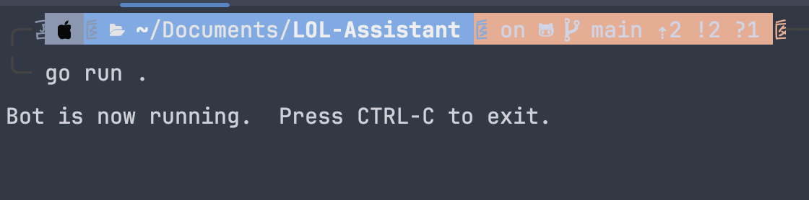

# Go와 Gemini를 활용하여 League of Legends Assistant Discord Bot 만들기

## Install
```shell
go get -u github.com/bwmarrin/discordgo
go get -u github.com/google/generative-ai-go
go get -u github.com/joho/godotenv
```

## env
```dotenv
BOT_TOKEN="디스코드 봇 토큰"
GEMINI_API_KEY="Gemini API Key"
GEMINI_INSTRUCTIONS="Gemini 지침사항"
RIOT_GAMES_API_KEY="Riot Games API Key"
```
```shell
cp .env.example .env
```
`.env.exapmle`파일을 카피하여 `.env` 파일을 만들어 주세요.

## Slide
[링크](https://docs.google.com/presentation/d/1Ja5rL4fyNQ3PSRv_hyy23PqtVl0dL-nuZG1BwClwn5k/edit?usp=sharing )

## riot games open api
[링크](https://developer.riotgames.com/apis)

## discord bot
[링크](https://discord.com/developers/applications)

## How to use
### Run
```shell
go mod tidy
go run .
```


### 명령어
```
디코봇아 ${프롬프트}
```
- Gemini와 대화를 할 수 있습니다. (슬라이드 참조)

```
내가 마지막으로 플레이한 게임을 분석해줘|${닉네임}#${태그}
```
- 라이엇 오픈 API를 사용하여 마지막으로 플레이한 게임을 Gemini가 분석해줍니다. (슬라이드 참조)
